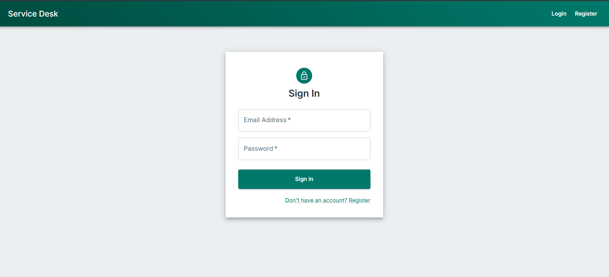
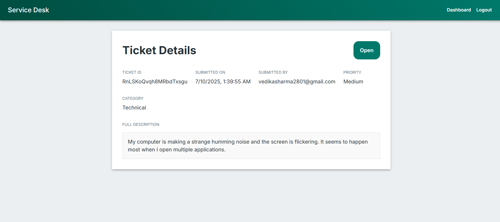

# ServiceFlow

A modern, responsive Service Desk and Ticketing System built from the ground up using React and Firebase. This project enables users to raise, track, and manage support tickets, while providing an efficient dashboard for administrators to resolve them.

It is a complete helpdesk platform where users can submit issues or requests, and administrators can manage the entire ticket lifecycle from a centralized dashboard.

---

## 📸 Screenshots

Here is a gallery of the key pages in the application.

**Login Page**



**User Dashboard**


**New Ticket Form**


**Ticket Detail View**



---

## ✨ Features

- **Secure User Authentication:** Full user registration and login system powered by Firebase Authentication.
- **Comprehensive Ticket Creation:** Users can raise tickets with a description, priority level (Low, Medium, High), and category (Technical, Billing, etc.).
- **User Dashboard:** Personalized dashboard for users to view a list of their own submitted tickets and track their current status.
- **Admin Management Dashboard:** A protected route for administrators to view, manage, and update the status of *all* tickets from all users.
- **Real-time Status Updates:** Ticket statuses update in real-time on the user's dashboard without needing a page refresh, thanks to Firestore's snapshot listeners.
- **Protected Routes:** Key application areas (like dashboards and ticket creation) are accessible only to authenticated users.
- **Responsive & Modern UI:** Built with Material-UI (MUI) for a professional, clean, and seamless experience across desktops, tablets, and mobile devices.

---

## 🛠️ Tech Stack

### Frontend
- **React 18**
- **React Router** for client-side routing and navigation
- **Material-UI (MUI)** for a comprehensive suite of UI components
- **Firebase SDK (v9+)** for interacting with Firebase services

### Backend & Database (BaaS - Backend-as-a-Service)
- **Firebase Authentication** for user management and security
- **Cloud Firestore** as a real-time, scalable NoSQL database for storing user and ticket data
- **Firebase Hosting** for easy and fast application deployment

---

## 🚀 Getting Started

Follow these instructions to get a copy of the project up and running on your local machine for development and testing purposes.

### Prerequisites

- [Node.js](https://nodejs.org/en/) (v18 or later recommended)
- A **Firebase Project**. You can create one for free at the [Firebase Console](https://console.firebase.google.com/).

### Installation & Setup

1.  **Clone the repository**
    ```sh
    git clone https://github.com/vedikasharma2801/celebal.git
    cd celebal
    cd Project
    ```

2.  **Install Dependencies**
    ```sh
    # This command installs all frontend packages, including React, MUI, and Firebase.
    npm install
    ```

3.  **Setup Firebase Configuration**
    - In your Firebase project console, go to **Project settings** (⚙️ icon) > **General** tab.
    - Under "Your apps", click the web icon (`</>`) to get your configuration object.
    - Create a new file at `src/services/firebase.js`.
    - Copy your configuration object into this file, as shown in the "Firebase Configuration" section below.

### 🚀 Running the Application

1.  **Run the Frontend Development Server**

    ```sh
    # This command starts the React app on http://localhost:3000
    npm start
    ```
    Your application should now be running locally!

### Firebase Configuration

You need to create the `src/services/firebase.js` file and populate it with the configuration keys from your own Firebase project.

```javascript
// src/services/firebase.js

import { initializeApp } from "firebase/app";
import { getAuth } from "firebase/auth";
import { getFirestore } from "firebase/firestore";

// TODO: Replace with your project's customized Firebase configuration
const firebaseConfig = {
  apiKey: "AIzaSyYOUR_API_KEY_HERE",
  authDomain: "your-project-id.firebaseapp.com",
  projectId: "your-project-id",
  storageBucket: "your-project-id.appspot.com",
  messagingSenderId: "YOUR_MESSAGING_SENDER_ID",
  appId: "YOUR_APP_ID"
};


// Initialize Firebase
const app = initializeApp(firebaseConfig);

// Initialize and export Firebase services
export const auth = getAuth(app);
export const db = getFirestore(app);
```