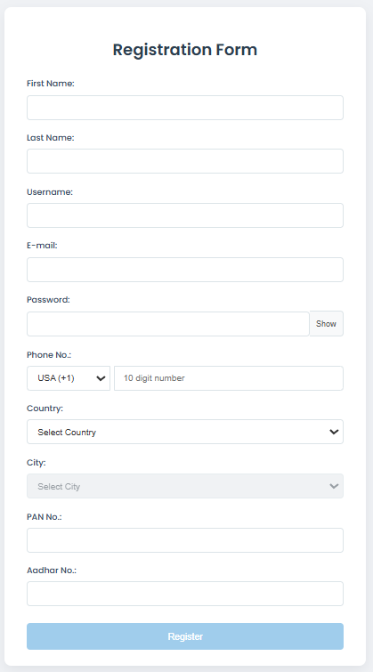
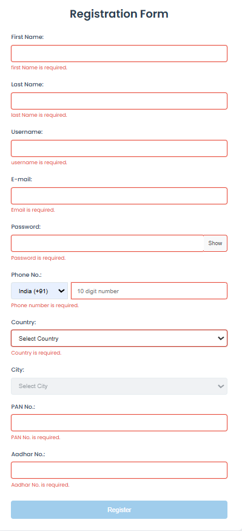
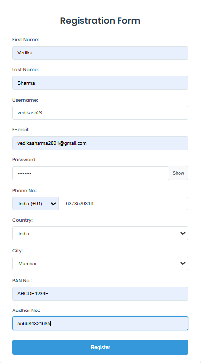
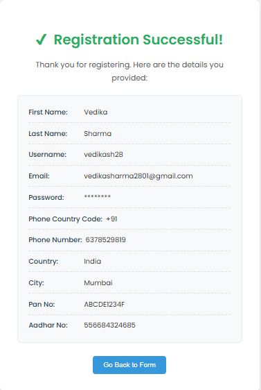

# React Registration Form with Advanced Validation

This project demonstrates a client-side registration form built with React. It includes comprehensive validation for all required fields without relying on third-party libraries, dynamic dependent dropdowns for country and city selection, password visibility toggle, and displays all successfully submitted data on a separate "success" page using React Router DOM. The form is styled for a professional and user-friendly experience.

## Registration Form:






## Key Features

*   **Comprehensive Input Fields:**
    *   First Name (Required)
    *   Last Name (Required)
    *   Username (Required, specific format)
    *   E-mail (Required, email format validation)
    *   Password (Required, minimum length, show/hide functionality)
    *   Phone Number (Country code dropdown + 10-digit number, required)
    *   Country (Dropdown, required)
    *   City (Dropdown, dependent on selected country, required if country selected)
    *   PAN No. (Required, specific format validation)
    *   Aadhar No. (Required, 12-digit number validation)
*   **Client-Side Validation:** All validations are performed in the browser without external libraries.
*   **Real-time Error Messages:** Clear error messages are displayed beneath each field if validation fails.
*   **Submission Control:** The "Register" button remains disabled until all required fields are filled correctly according to validation rules.
*   **Dynamic Dependent Dropdowns:** The "City" dropdown options are dynamically populated based on the selected "Country".
*   **Password Visibility:** Users can toggle the visibility of the password field.
*   **Data Display on Success:** Upon successful submission, users are redirected to a `/success` route where all entered details (except password for security) are displayed.
*   **Routing:** Implemented using `react-router-dom` (v6) for navigating between the form and the success page.
*   **Styling:** Custom CSS is used to provide a clean, professional, and responsive design.
*   **No External Form/Validation Libraries:** Built purely with React hooks and JavaScript.

## Tech Stack

*   **React (v18+)**
*   **React Router DOM (v6)**
*   **JavaScript (ES6+)**
*   **HTML5**
*   **CSS3** (Custom Styling, Flexbox)

## Project Structure
my-app/
├── public/
│ ├── favicon.ico
│ └── index.html
├── src/
│ ├── components/
│ │ ├── RegistrationForm.js # Main form compo. logic and JSX
│ │ ├── RegistrationForm.css # Styles for the reg. form
│ │ ├── SuccessPage.js # Component to display submitted data
│ │ └── SuccessPage.css # Styles for the success page
│ ├── data/
│ │ └── locations.js # Data for country/city dropdowns 
│ ├── App.js # Main application component with routing setup
│ ├── App.css # Global application styles
│ ├── index.js # Entry point of the React application
│ └── index.css # Global base styles
├── .gitignore
├── package.json
└── README.md


## Getting Started

Follow these instructions to get a copy of the project up and running on your local machine for development and testing purposes.

### Prerequisites

*   Node.js (v14 or later recommended)
*   npm (v6 or later) or yarn

### Installation & Setup

1.  **Clone the repository (or download the source code):**
    ```bash
    git clone <your-repository-url>
    cd my-react-form
    ```
    (If you downloaded a ZIP, extract it and navigate into the project folder.)

2.  **Install dependencies:**
    Open your terminal in the project root and run:
    ```bash
    npm install
    ```
    or if you use yarn:
    ```bash
    yarn install
    ```

### Running the Application

1.  **Start the development server:**
    ```bash
    npm start
    ```
    or
    ```bash
    yarn start
    ```
2.  Open your web browser and navigate to `http://localhost:3000` (or the port specified in your terminal).

## Available Scripts

In the project directory, you can run:

### `npm start` or `yarn start`

Runs the app in development mode.
Open [http://localhost:3000](http://localhost:3000) to view it in the browser.
The page will reload if you make edits. You will also see any lint errors in the console.

### `npm run build` or `yarn build`

Builds the app for production to the `build` folder.
It correctly bundles React in production mode and optimizes the build for the best performance.
The build is minified and the filenames include the hashes.

---

