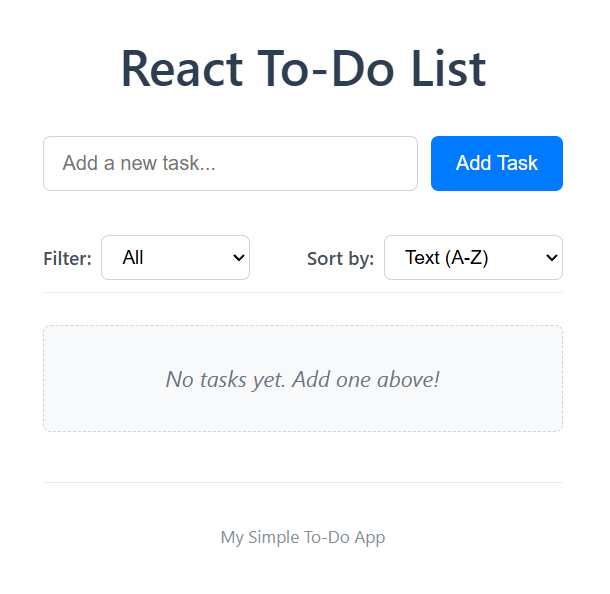
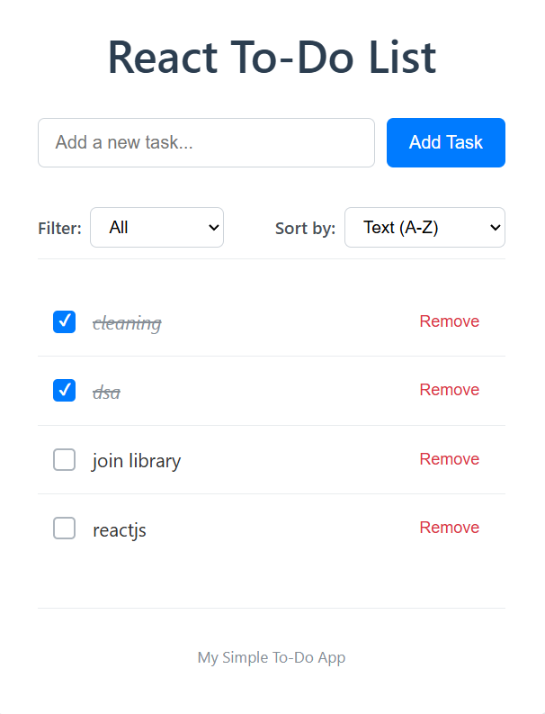
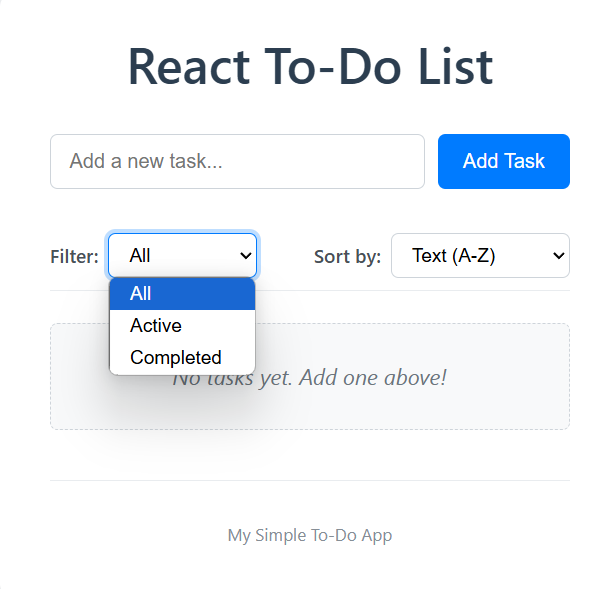

# React To-Do List Application ✅

A simple yet functional To-Do List application built with React. This project allows users to add, remove, and mark tasks as complete. It also includes features like input validation, dynamic task display, filtering, sorting, and local storage persistence.

## To-Do List Page





## 🌟 Features

*   **Task Addition:** Add new tasks to your to-do list.
    *   Input validation to prevent empty or duplicate tasks.
*   **Task Removal:** Remove tasks you no longer need.
*   **Task Completion:** Mark tasks as completed or active.
*   **Dynamic Display:** Tasks are rendered dynamically as they are added or modified.
*   **Filtering:**
    *   View all tasks.
    *   View only active (incomplete) tasks.
    *   View only completed tasks.
*   **Sorting:**
    *   Sort tasks by creation date (newest first by default).
    *   Sort tasks alphabetically by text (A-Z).
*   **Local Storage Persistence:** Your tasks are saved in the browser's local storage, so they persist even after closing the browser or refreshing the page.
*   **Responsive Design:** Basic responsive styling for usability on different screen sizes.
*   **Clean UI:** A modern and clean user interface for a pleasant user experience.

## 🛠️ Technologies Used

*   **React:** (v18+) JavaScript library for building user interfaces (using Functional Components and Hooks).
*   **Vite:** Next-generation frontend tooling for a fast development experience.
*   **JavaScript (ES6+):** Core programming language.
*   **HTML5:** Markup language.
*   **CSS3:** Styling language for presentation.
    *   Custom CSS for styling components.
*   **Git:** Version control system.

## 📋 Prerequisites

Before you begin, ensure you have the following installed:

*   [Node.js](https://nodejs.org/) (v16.x or higher recommended)
*   [npm](https://www.npmjs.com/) (usually comes with Node.js) or [Yarn](https://yarnpkg.com/)
*   [Git](https://git-scm.com/)

## 🚀 Getting Started

Follow these instructions to get a copy of the project up and running on your local machine for development and testing purposes.

1.  **Clone the repository:**
    ```bash
    git clone <your-repository-url>
    cd my-todo-app
    ```
    (Replace `<your-repository-url>` with the actual URL of your Git repository)

2.  **Install dependencies:**
    Using npm:
    ```bash
    npm install
    ```
    Or using Yarn:
    ```bash
    yarn install
    ```

3.  **Configure Git User (if you haven't already globally):**
    If Git prompts you or you see errors related to `user.name` or `user.email`, configure them:
    ```bash
    git config --global user.name "Your Name"
    git config --global user.email "youremail@example.com"
    ```

## ධ Running the Application

To start the development server:

```bash
npm run dev

