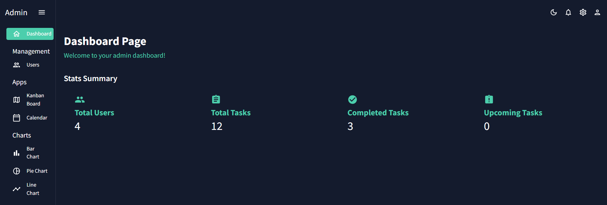
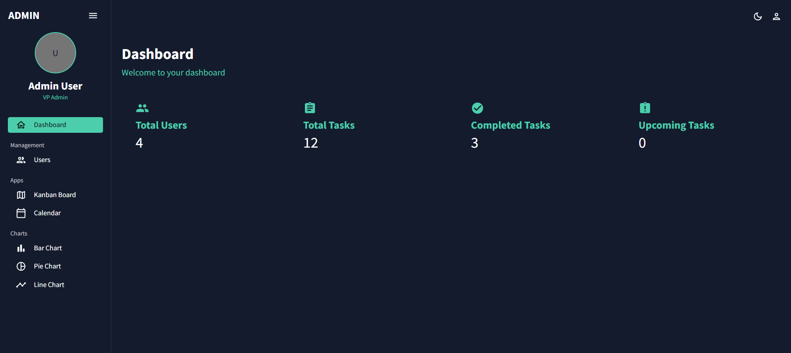
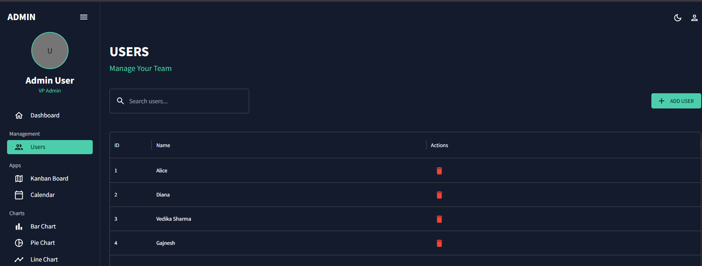
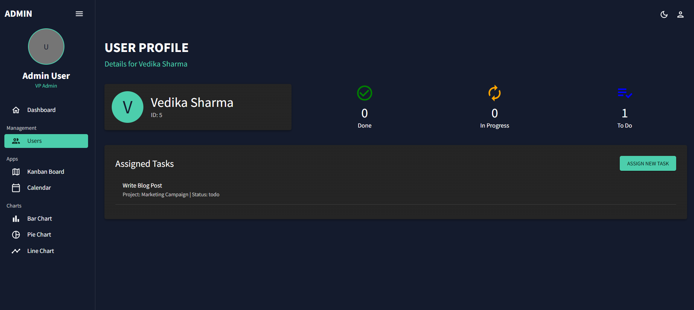
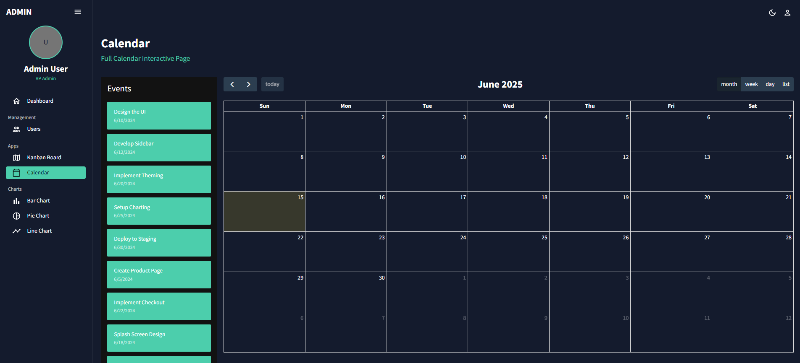
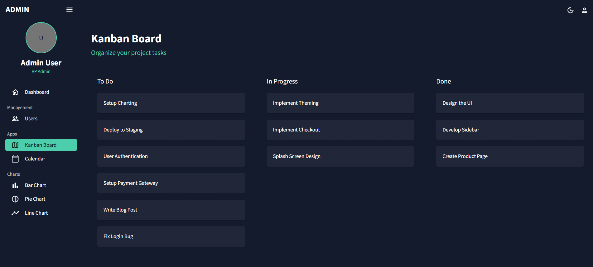
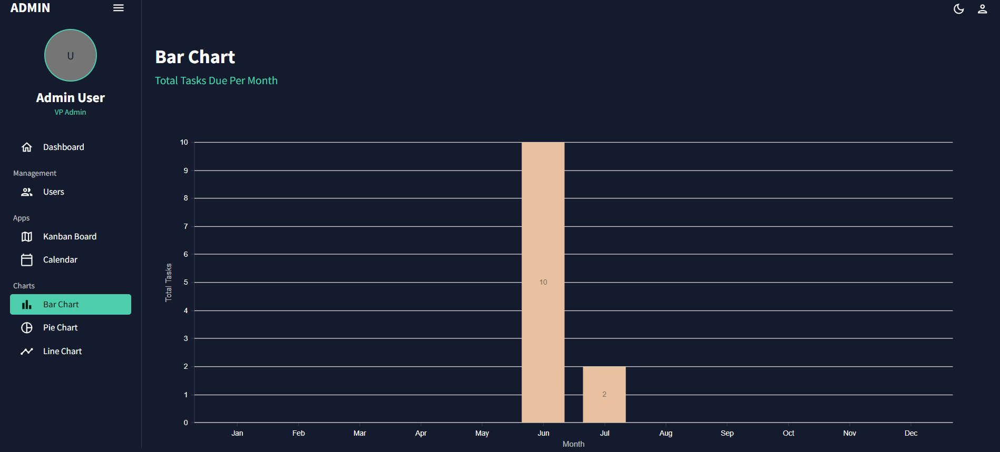
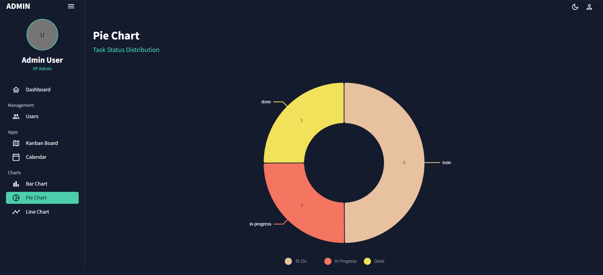
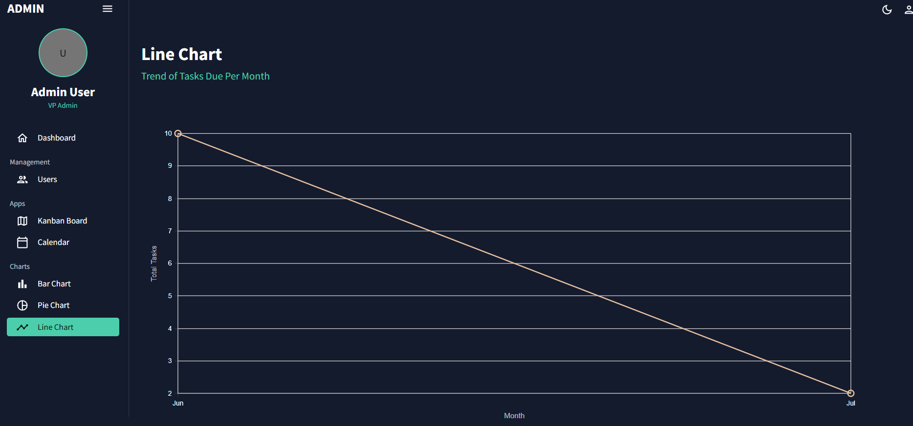

# React Admin Dashboard

A comprehensive and interactive admin dashboard built with React.js. This project features a modern UI using Material-UI, a custom theming engine for light/dark modes, and a suite of tools for data visualization and task management.

## Screenshots

*(Note: These screenshots reflect the project's state before the latest UI updates to the sidebar and topbar.)*

**Dashboard Overview (Dark Mode)**


**Dashboard Overview with Modal (Dark Mode)**


**Users Page (Dark Mode)**


**User's Profile Page (Dark Mode)**


**Calendar Page (Dark Mode)**


**Kanban Page (Dark Mode)**


**Bar Chart Page (Dark Mode)**


**Pie Chart Page (Dark Mode)**


**Line Chart Page (Dark Mode)**


## Key Features

-   **Responsive & Collapsible Sidebar:** A modern, collapsible navigation bar with a user profile section and smooth animations.
-   **Customizable Theming:** Easily switch between a sleek **dark mode** and a clean **light mode**. The theme is managed via React Context.
-   **Interactive Dashboard:** Features dynamic stat boxes that open modals to display detailed data (e.g., list of users, tasks).
-   **User Management (CRUD):** A dedicated "Users" page where an admin can:
    -   View all users in a searchable data grid with **stable, sequential numbering**.
    -   Add new users via a modal form.
    -   Delete existing users.
-   **Detailed User View:** Click on any user to navigate to a detailed profile page, showing their assigned tasks and key statistics.
-   **Task Assignment:** Admins can assign unassigned tasks to specific users directly from the user detail page.
-   **Interactive Calendar:** A full-featured calendar that displays all tasks by their due dates. Admins can also add and delete events directly on the calendar.
-   **Multi-Column Kanban Board:** A drag-and-drop Kanban board to visualize task workflow across "To Do," "In Progress," and "Done" columns.
-   **Data Visualization:** Includes three types of charts powered by Nivo:
    -   **Bar Chart:** Visualizing total tasks due per month.
    -   **Pie Chart:** Showing the distribution of tasks by their current status.
    -   **Line Chart:** Tracking the trend of tasks due over time.
-   **Data Persistence:** Application state (users and tasks) is managed globally with **Zustand** and saved to `localStorage`, so your data persists even after a browser refresh.

## Tech Stack

-   **Framework:** React 18
-   **UI Library:** Material-UI (MUI) v5
-   **State Management:** Zustand (for global state) & React Context API (for theming)
-   **Routing:** React Router v6
-   **Charts:** Nivo
-   **Drag & Drop:** Dnd-Kit (for the Kanban board)
-   **Calendar:** FullCalendar

## Getting Started

Follow these instructions to get a copy of the project up and running on your local machine for development and testing purposes.

### Prerequisites

You will need to have Node.js and npm installed on your machine.
-   [Node.js](https://nodejs.org/) (v18.x or later recommended)
-   npm (comes bundled with Node.js)

### Installation

1.  **Clone the repository:**
    ```bash
    git clone https://github.com/your-username/your-repository-name.git
    ```

2.  **Navigate to the project directory:**
    ```bash
    cd <project-directory>
    ```

3.  **Install the dependencies:**
    ```bash
    npm install
    ```

### Running the Application

Once the installation is complete, you can start the development server:

```bash
npm start