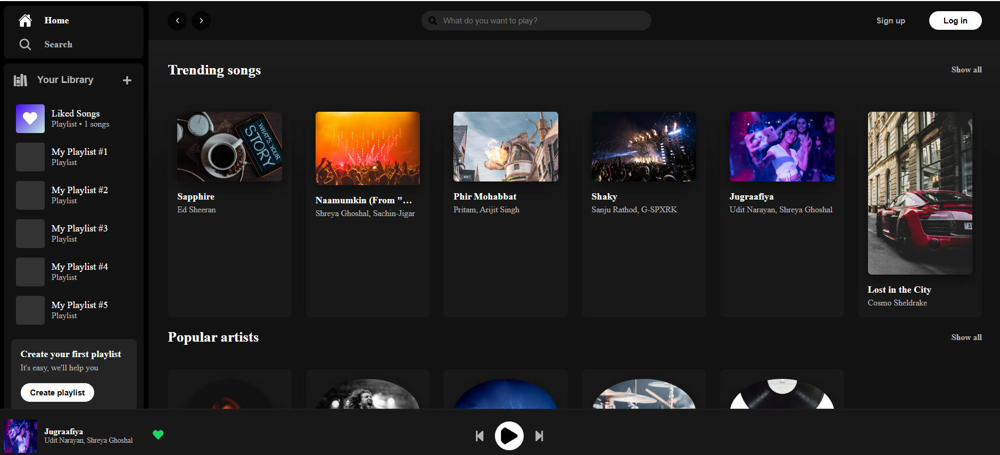
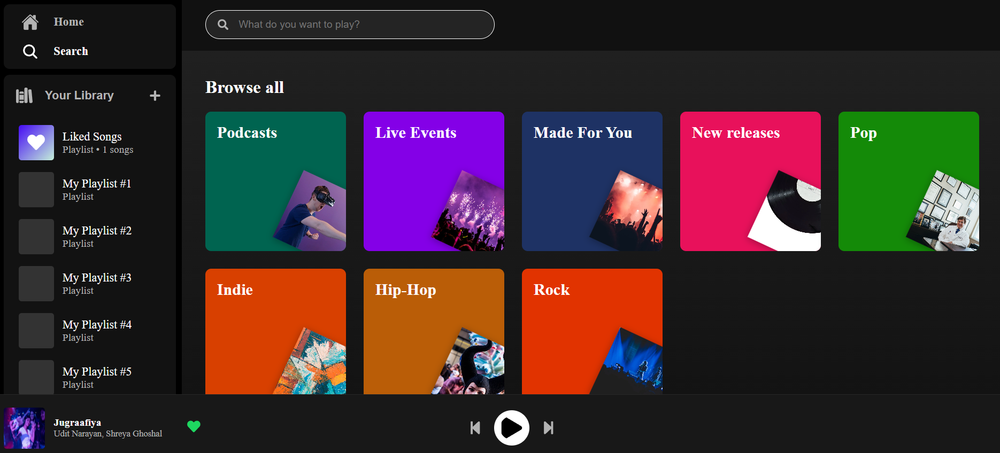
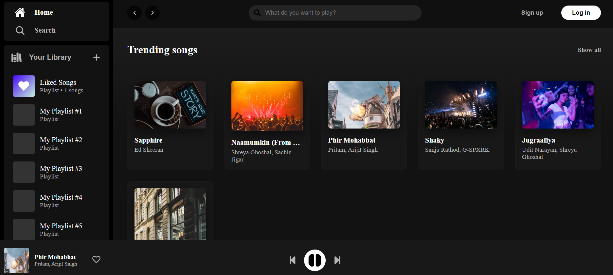

# Spotify 2.0 Clone

<p align="center">
  
</p>

A feature-rich, front-end clone of the Spotify web player, built with modern web technologies. This project showcases a responsive and interactive user interface that mimics the core user experience of browsing, searching, playing, and personalizing music.

---

## 📸 Screenshots





---

## ✨ Features

- **Beautiful UI**: A clean, responsive user interface inspired by the official Spotify web player.
- **Full Playback Controls**: Play, pause, skip to the next song, or go back to the previous one.
- **State Management with Redux**: Centralized state management using Redux Toolkit for the player, playlists, and liked songs, ensuring a predictable and stable application state.
- **Dynamic Search Page**: A functional search page that allows users to find songs by title or artist. It features a "Browse All" view with colorful category cards by default.
- **"Like" Functionality**: Users can "like" any song from the player.
- **Automatic "Liked Songs" Playlist**: A "Liked Songs" playlist is automatically created and displayed in the user's library as soon as the first song is liked, complete with a live song count.
- **Playlist Creation**: Users can create their own custom playlists, which appear in the library.
- **Routing**: Seamless client-side navigation between Home and Search pages using React Router.

---

## 🛠️ Tech Stack

This project was built using the following technologies:

- **React.js**: A JavaScript library for building user interfaces.
- **Redux Toolkit**: The official, opinionated, batteries-included toolset for efficient Redux development.
- **React Redux**: Official React bindings for Redux.
- **React Router**: For declarative routing in the application.
- **CSS Modules**: For locally scoped, component-level CSS styling to avoid class name conflicts.
- **React Icons**: A library providing a huge collection of popular icon sets.

---

## 🚀 Getting Started

To get a local copy up and running, follow these simple steps.

### Prerequisites

You need to have Node.js and npm installed on your machine.
- [Node.js](https://nodejs.org/) (which includes npm)

### Installation & Setup

1.  **Clone the repository**
    ```sh
    git clone https://github.com/vedikasharma2801/celebal.git
    ```

2.  **Navigate to the project directory**
    ```sh
    cd celebal
    cd ass05
    cd spotify-clone-2.0
    ```

3.  **Install NPM packages**
    This will install all the necessary dependencies for the project.
    ```sh
    npm install
    ```

4.  **Run the application**
    This will start the development server, and the app will open in your browser at `http://localhost:3000`.
    ```sh
    npm start
    ```

---

## 📂 Folder Structure

The project follows a standard feature-sliced design pattern to keep the code organized, scalable, and easy to maintain.

```
/src
├── app/
│   └── store.js            # Redux store configuration
├── components/
│   ├── Header/             # Header component
│   ├── Player/             # Global music player component
│   ├── Sidebar/            # Main navigation sidebar
│   └── SongCard/           # Reusable card for displaying a song
├── data/
│   └── mockData.js         # Mock data for songs and artists
├── features/
│   ├── player/
│   │   └── playerSlice.js  # Redux slice for player state
│   └── playlist/
│       └── playlistSlice.js# Redux slice for playlists and liked songs
├── pages/
│   ├── Home/               # Home page component
│   └── Search/             # Search page component
├── App.js                  # Main application component with routing
└── index.js                # Entry point of the React application
```