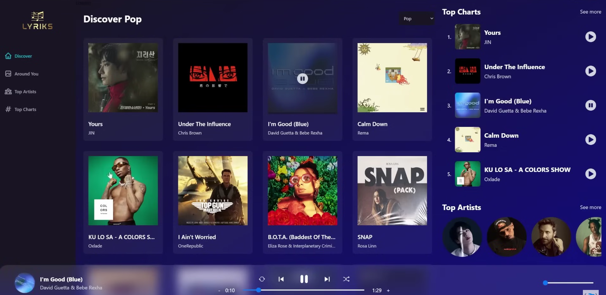
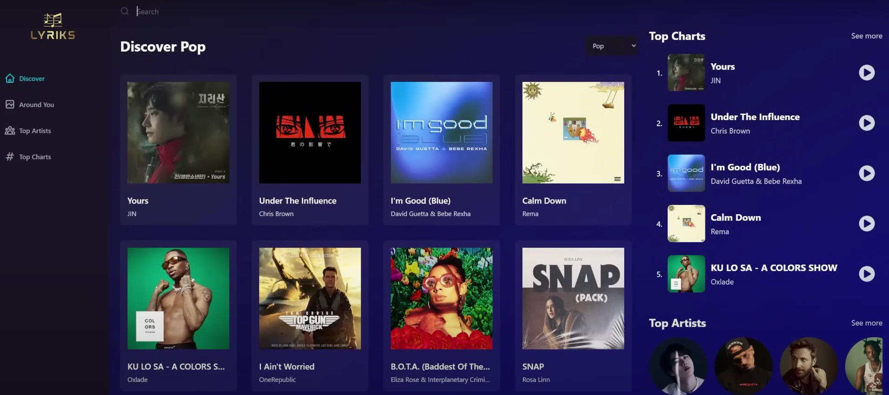
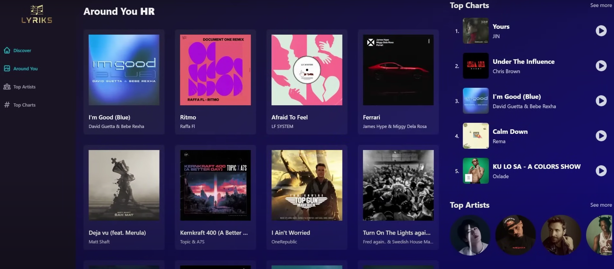

# 🎵 React Redux Music Player

A modern music streaming web app built with **React**, **Redux Toolkit**, **Tailwind CSS**, and the Shazam Core API. It lets you discover top charts, view artists, get song details and lyrics, and play songs with a responsive, clean music player UI.

---

## 🚀 Features

✅ Discover top charts  
✅ Play/pause any song  
✅ View lyrics and song details  
✅ See top artists  
✅ Fully responsive design  
✅ Smooth animations  
✅ Redux-powered state management  
✅ Tailwind CSS styling  

---

## 📂 Folder Structure

The project follows a standard feature-sliced design pattern to keep the code organized, scalable, and easy to maintain.

```
src/
│
├── assets/
│ └── constants.js
│
├── components/
│ ├── DetailsHeader.jsx
│ ├── Error.jsx
│ ├── Loader.jsx
│ ├── MusicPlayer.jsx
│ ├── PlayPause.jsx
│ ├── RelatedSongs.jsx
│ ├── Searchbar.jsx
│ ├── Sidebar.jsx
│ ├── SongCard.jsx
│ └── TopPlay.jsx
│
├── pages/
│ ├── AroundYou.jsx
│ ├── ArtistDetails.jsx
│ ├── Discover.jsx
│ ├── Search.jsx
│ ├── SongDetails.jsx
│ ├── TopArtists.jsx
│ └── TopCharts.jsx
│
├── redux/
│ ├── features/
│ │ └── playerSlice.js
│ └── services/
│ └── shazamCore.js
│
├── App.jsx
├── main.jsx
└── index.css
```
---

## ⚙️ Installation

1️⃣ **Clone the repository:**

```bash
git clone https://github.com/vedikasharma2801/celebal.git
cd celebal
cd ass06
cd Viber
```

2️⃣ **Install dependencies**
```bash
npm install
```

3️⃣ **Setup your API key**
Create a .env file in the project root:

```bash
VITE_SHAZAM_CORE_RAPID_API_KEY=your_rapidapi_key_here
```

4️⃣ **Run the development server**
```bash
npm run dev
```

**Visit http://localhost:5173 to see the app running.**

## 🌐 API Details
This project uses the Shazam Core API from RapidAPI to fetch songs, artists, and lyrics. You must sign up on RapidAPI to get a free API key and add it to your .env as shown above.
**🛠️ Built With**
React
Redux Toolkit
React Router
Tailwind CSS
Shazam Core API (RapidAPI)
Vite

## 📸 Screenshots





